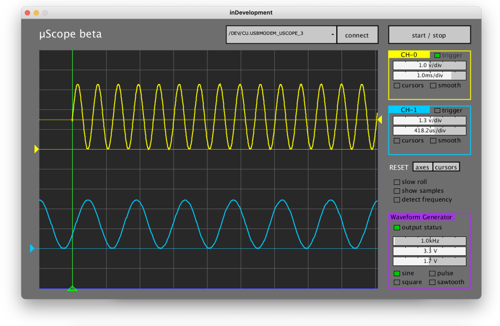

# μScope Project
__Open source instrumentation for Arduino__

Simultaneous use of audio-bandwidth oscilloscope and function generator, with cross-platform support for Windows and macOS.
Intended for use with the MKRZero or other SAMD21 boards. 

Development of has taken place in Visual Studio Code within the PlatformIO extension and in Processing.

__Supported boards__

1. MKR Zero

